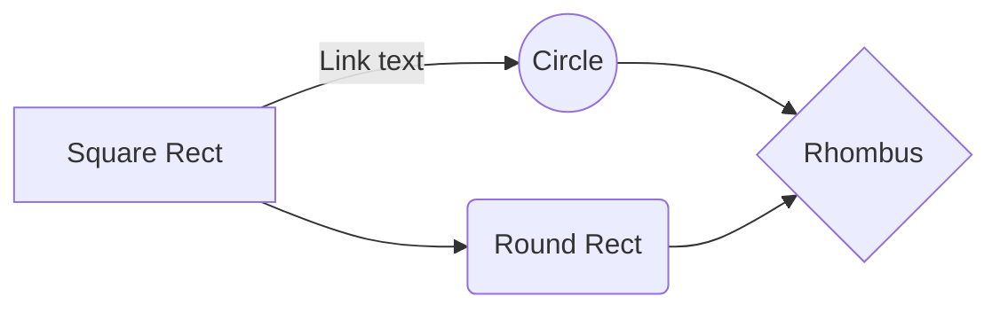

# Setting up the Development Environment for React Native in Windows (Targeting Android)

This guide will walk you through setting up the development environment for React Native on a Windows machine, with Android as the target operating system.

## Prerequisites

1. **Node.js and npm**: Make sure you have Node.js and npm installed. You can download and install them from the [official Node.js website](https://nodejs.org/).
2. **Android Studio**

## Installing Android Studio and Configuring Environment for React Native on Windows

These are the steps I followed to install Android Studio and configure the necessary environment variables for React Native development on a Windows machine.

## Step 1: Installing Android Studio

1. Download Android Studio from the [official website](https://developer.android.com/studio).
2. Run the downloaded executable file to start the installation process.

3. **Select Installation Type**:

   - Choose "Standard" installation.

4. **Choose Theme**:

   - Select between light or dark.

5. **Components Setup**: Make sure you have selected:

- `Android SDK`
- `Android SDK Platform`
- `Android Virtual Device`
- `Performance Intel`

6. **Choose Installation Location**:

   - Choose the installation location or use the default taking in account it will take some space.

7. **Accept Licence Agreement**: Select each of the licences and mark "Accept".

8. **Completing the Installation**:
   - Click "Finish" to complete the installation.

## Step 2: Configuring Environment Variables

1. Open the Windows Control Panel.

2. Click on "User Accounts", then click "User Accounts" again.

3. Click on "Change my environment variables".

4. **Adding ANDROID_HOME**:

   - Click "New..." to create a new user variable.
   - Set the variable name as `ANDROID_HOME`.
   - Find the path to your Android SDK in Android Studio "Settings" dialog, under "Languages & Frameworks" → "Android SDK".
   - Set the variable value to the path of your Android SDK (e.g., `C:\Android\SDK`).

5. Open a new Command Prompt window to ensure the new environment variable is loaded before proceeding to the next step.

6. **Verify ANDROID_HOME**:

   - Open PowerShell.
   - Copy and paste the following command to verify `ANDROID_HOME` has been added:
     ```bash
     Get-ChildItem -Path Env:\
     ```

7. **Adding platform-tools to Path**:

   - Select the "Path" variable.
   - Click "Edit".
   - Click "New" and add the path to `platform-tools` to the list (e.g., `C:\Android\SDK\platform-tools`).

8. Click "OK" to save the changes.

## Conclusion

You have successfully installed Android Studio and configured the necessary environment variables for React Native development on Windows. Happy coding!

```bash
npm install -g react-native-cli
```


